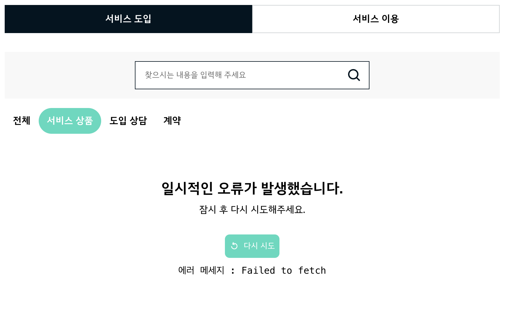
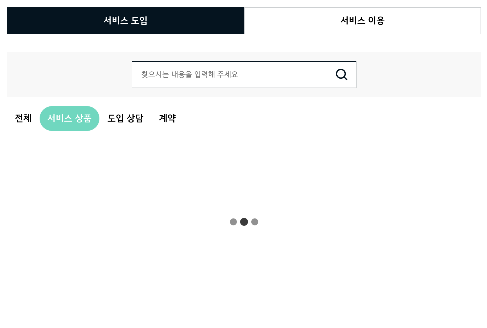

## 목차

- [기술 스택](#기술-스택)
- [설치 및 실행](#설치-및-실행)
- [디렉토리 구조](#디렉토리-구조)
- [개발 환경 설정](#개발-환경-설정)
- [스타일링 전략](#스타일링-전략)
- [데이터 fetch 전략](#데이터-fetch-전략)
- [폼 상태 관리와 유효성 검증 전략](#폼-상태-관리와-유효성-검증-전략)
- [SEO 전략](#seo-전략)
- [테스트 전략](#테스트-전략)

## 기술 스택

- **프레임워크**: Next.js
- **스타일링**: CSS Modules, SASS
- **상태 관리**: React Query, React Hook Form
- **폼 유효성 검증**: Zod
- **API 모킹**: MSW (Mock Service Worker), Next.js API Routes
- **테스트**: Vitest, React Testing Library
- **패키지 매니저**: pnpm
- **코드 품질**: ESLint, Prettier, Husky, Lint-staged
- **CI/CD**: GitHub Actions

## 설치 및 실행

```bash
# 패키지 설치
pnpm install

# 개발 서버 실행
pnpm dev

# 빌드
pnpm build

# 테스트 실행
pnpm test
```

## 디렉토리 구조
```
app/ # Next.js App Router 디렉토리
├── layout.tsx # 루트 레이아웃
├── page.tsx # 홈페이지
├── favicon.ico # 파비콘
├── manifest.ts # PWA 매니페스트 설정
├── robots.ts # 검색 엔진 크롤링 설정
└── sitemap.ts # 사이트맵 설정
mocks/ # API 모킹
types/ # 타입 정의
components/ # 컴포넌트
lib/ # 라이브러리
└── react-query/ # React Query 관련 유틸리티
services/ # 서비스
├── faq.ts # 서비스 함수
├── queryKeys.ts # 쿼리 키 정의
└── useFaqService.ts # 자주 묻는 질문 서비스 훅
utils/ # 유틸리티 함수
styles/ # 전역 스타일
assets/ # 정적 자산
```

## 개발 환경 설정
- `ESLint`, `Prettier` 를 활용한 코드 스타일 일관성 유지
- `Husky`, `Lint-staged` 를 활용한 커밋 전 코드 검증
- `GitHub Actions` 를 활용한 CI 파이프라인 구성
  - 의존성 설치, 테스트 실행, 빌드 단계로 구성

## 스타일링 전략
### 1. CSS 변수
- 색상, 간격 등의 공통 스타일 값을 변수로 정의
  ```scss
  // styles/global.scss
  :root {
    --mint-900: #70d7bf;
    --mint-700: #8ddfcc;
    --midnight-900: #05141f;
    // ...
  }
  ```
### 2. SASS
- CSS Modules 와 통합하여 컴포넌트별 스코프 유지
- 색상, 간격 등의 공통 스타일 값을 **SASS 변수로 정의**하여 일관성 유지 및 유지보수 용이하도록 함
- CSS 변수를 SASS 변수로 매핑하여 개발 편의성 향상
  ```scss
  // styles/_colors.scss
  $mint-900: var(--mint-900);
  $mint-700: var(--mint-700);
  $midnight-900: var(--midnight-900);
  // ...
  ```
- 반응형 디자인을 위해 **브레이크 포인트 값과 미디어 포인트 믹스인을 정의**하여 개발 편의성 향상, 코드 중복 감소
  ```scss
  // styles/_breakpoints.scss
  $breakpoints: (
    mobile: 743px,   // 모바일 최대 너비
    tablet: 1023px,  // 태블릿 최대 너비
    desktop: 1439px  // 소형 데스크탑 최대 너비
  );

  /**
  * 모바일 장치에만 적용되는 스타일
  * 최대 너비: 743px
  */
  @mixin mobile {
    @media (max-width: map.get($breakpoints, mobile)) {
      @content;
    }
  }
  ```

## 데이터 fetch 전략
### 1. 서비스 레이어 분리
- 데이터 fetch 로직을 분리하여 API 호출과 상태 관리를 UI 컴포넌트와 별도로 관리
  ```ts
  // services/faq.ts
  export const fetchCategories = async () => {
    const response = await fetch('/api/categories');
    return response.json();
  };
  ```

- React Query 의 기능을 커스텀 훅으로 래핑해 사용. 쿼리 키 관리, 데이터 변환 등의 공통 로직 캡슐화
  ```ts
  // services/useFAQService.ts
  export function useFaqList({
    category,
    subCategory = 'ALL',
    limit = 10,
    query,
  }: UseFaqListParams) {
    return useSuspenseInfiniteQuery({
      queryKey: QUERY_KEYS.FAQ.LIST(category, subCategory, query),
      queryFn: ({ pageParam = 0 }) =>
        fetchFaqs(category, subCategory, pageParam, limit, query),
      initialPageParam: 0,
      getNextPageParam: (lastPage) => {
        const { offset, limit, totalRecord } = lastPage.pageInfo;
        if (offset + limit >= totalRecord) return undefined;
        return offset + limit;
      },
    });
  }
  ```
- 컴포넌트에서는 서비스 레이어에서 받은 데이터를 소비하여 UI 렌더링에 집중
  ```tsx
  // components/SubCategoryTab.tsx
  export default function SubCategoryTab({
    category,
    children,
  }: SubCategoryTabProps) {
    const { data } = useFaqCategories(category);

    return (
      <Tab defaultTab="ALL">
        <TabList>
          <TabButton id="ALL" >
            전체
          </TabButton>
          {data?.map((item) => (
            <TabButton id={item.id}>
              {item.name}
            </TabButton>
          ))}
        </TabList>
      </Tab>
    );
  }
  ```

### 2. 쿼리 키 관리
- 쿼리 키를 중앙에서 상수로 관리해 일관성 유지 및 키 충돌 방지
  ```ts
  // services/queryKeys.ts
  export const QUERY_KEYS = {
    FAQ: {
      CATEGORIES: (category: CategoryType) =>
        ['faq', 'categories', category] as const,
      LIST: (
        category: CategoryType,
        subCategory: SubCategoryType,
        query?: string,
      ) => ['faq', 'list', category, subCategory, query].filter(Boolean),
    },
  } as const;
  ```

### 3. 로딩 및 에러 처리
- React Suspense 와 함께 `useSuspenseQuery` 와 `useSuspenseInfiniteQuery` 를 사용하여 선언적 데이터 로딩 패턴 구현. 컴포넌트에서는 성공 케이스만 처리하고 에러, 로딩 상태를 상위로 위임
- `Suspense`, `ErrorBoundary`, `QueryErrorResetBoundary`를 통합한 래퍼 컴포넌트를 구현하여 **로딩 Fallback**, **Error Fallback**, **에러 복구 UI** 제공
  ```tsx
  // components/QueryErrorSuspenseBoundary.tsx
  export default function QueryErrorSuspenseBoundary({
    children,
    loadingFallback = <Loading />,
    errorFallback = ErrorFallback,
  }: {
    children: React.ReactNode;
    loadingFallback?: React.ReactNode;
    errorFallback?: React.ComponentType<FallbackProps>;
  }) {
    return (
      <Suspense fallback={loadingFallback}>
        <QueryErrorResetBoundary>
          {({ reset }) => (
            <ErrorBoundary FallbackComponent={errorFallback} onReset={reset}>
              {children}
            </ErrorBoundary>
          )}
        </QueryErrorResetBoundary>
      </Suspense>
    );
  }
  ```

<div style="display:flex; gap:20px; align-items:center;">
  
  
</div>

### 4. 서버 사이드 Prefetching
- Next.js의 서버 컴포넌트 환경에서 React Query의 데이터를 프리페치하고, 그 결과를 클라이언트 컴포넌트로 전달하기 위한 `PrefetchBoundary` 컴포넌트 구현. `await`를 사용하지 않는 **스트리밍 SSR** 방식을 채택해 데이터 로딩을 기다리지 않고 UI를 먼저 렌더링함으로써 초기 페이지 로드 속도를 개선하고 사용자 경험을 향상
  ```tsx
  // lib/react-query/PrefetchBoundary.tsx
  export default function PrefetchBoundary({fetchQueryOptions, children}: PrefetchBoundaryProps) {
    const queryClient = getQueryClient();

    // ...
    queryClient.prefetchQuery(fetchQueryOptions.options);

    return (
      <HydrationBoundary state={dehydrate(queryClient)}>
        {children}
      </HydrationBoundary>
    );
  }
  ```
- 사용자가 처음 페이지 접근 시 바로 보이는 서비스 도입 카테고리 데이터를 서버에서 prefetch
  ```tsx
  // components/FAQSection.tsx
  export default function FAQSection() {

    const fetchQueryOptions = [
      {
        type: 'query',
        options: {
          queryKey: QUERY_KEYS.FAQ.CATEGORIES('CONSULT'),
          queryFn: () => fetchCategories('CONSULT'),
        },
      },
      {
        type: 'infinite',
        options: {
          queryKey: QUERY_KEYS.FAQ.LIST('CONSULT', 'ALL'),
          queryFn: () => fetchFaqs('CONSULT', 'ALL'),
          initialPageParam: 0,
        },
      },
    ];

    return (
      <PrefetchBoundary fetchQueryOptions={fetchQueryOptions}>
        {/* ... */}
        <FAQList />
        {/* ... */}
      </PrefetchBoundary>
    )
  }
  ```
### 5. 데이터 캐싱
- 쿼리의 `staleTime`을 무한으로 설정하여 수동으로 무효화하기 전까지 새로운 API 요청을 하지 않도록 함
- `gcTime`을 무한으로 설정하여 컴포넌트가 언마운트되어도 가비지 컬렉션을 비활성화해 메모리에 유지하도록 함
- 브라우저를 닫거나 새로고침하면 캐시가 초기화되므로 API 재호출함
- FAQ 는 매우 정적인 데이터로 자주 변경되지 않으므로 **브라우저 세션동안 캐시를 활용하기 위함**
  ```ts
  // lib/react-query/queryClientOptions.ts
  const queryClientOptions = {
    defaultOptions: {
      queries: {
        staleTime: Infinity,
        gcTime: Infinity,
      },
      // ...
    },
  };
  ```

### 6. API 모킹 전략
- **MSW를 활용한 API 모킹**
  - 네트워크 수준에서 요청을 가로채 모의 응답 제공
  - 테스트 환경에서 안정적인 API 모킹 보장

- **Next.js API Routes 활용**
  - 백엔드 API와 동일한 형태의 엔드포인트 제공
  - 실제 백엔드 개발 없이도 프론트엔드 개발 진행 가능
  - 환경 변수를 통해 API 엔드포인트 전환 가능

## 폼 상태 관리와 유효성 검증 전략
- `React Hook Form`과 `Zod`를 활용한 타입 안전한 폼 유효성 검증
  ```tsx
  // schemas/searchSchema.ts
  import { z } from 'zod';

  export const searchSchema = z.object({
    search: z.string().trim().min(1, '검색어를 입력해주세요'),
  });

  export type SearchFormData = z.infer<typeof searchSchema>;
  ```

- 폼 컨텍스트를 활용한 컴포넌트 간 상태 공유
  ```tsx
  // components/FAQSearchForm.tsx
  export default function FAQSearchForm({ children }: { children: React.ReactNode }) {
    const form = useForm<SearchFormData>({
      resolver: zodResolver(searchSchema),
      defaultValues: {
        search: '',
      },
    });

    return (
      <FormProvider {...form}>
        {children}
      </FormProvider>
    );
  }
  ```

- `useFormContext`를 통한 폼 상태 접근 및 제출 처리
  ```tsx
  // components/SearchBar/index.tsx
  export default function SearchBar() {
    // ...

    const { register, handleSubmit } =
      useFormContext<SearchFormData>();

    const onSubmit = (e: React.FormEvent<HTMLFormElement>) => {
      e.preventDefault();
      handleSubmit((data) => {
        setQuery(data.search);
      })(e);
    };

    // ...
  }
  ```

## SEO 전략
- `title`, `description` 등 기본 메타데이터 설정
  ```ts
  // app/layout.tsx
  export const metadata: Metadata = {
    title: '위블 비즈(Wible Biz)',
    description:
      '위블 비즈는 기업을 위한 친환경 모빌리티 서비스로 차량부터 전용 App/Web까지 업무차량 토탈 솔루션을 제공합니다.',
    // ...
  };
  ```
- viewport 설정 : 모바일 환경에서 최적화
  ```ts
  // app/layout.tsx
  export const viewport: Viewport = {
    themeColor: '#000000',
    width: 'device-width',
    initialScale: 1,
    maximumScale: 1,
    userScalable: false,
  };
  ```
- `sitemap.ts` : 사이트맵 설정
- `manifest.ts` : PWA 관련 매니페스트 설정
- `favicon.ico` : 파비콘 설정
- `robots.ts` : 검색 엔진 크롤링 규칙 설정


## 테스트 전략
### 1. 컴포넌트 테스트
- BDD(Behavior-Driven Development) 스타일로 작성, 각 컴포넌트의 핵심 기능과 사용자 접근성 검증
### 2. API 호출 테스트
- fetchCategories 함수의 API 호출 및 응답 처리 검증
- fetchFaqs 함수의 정상 응답 처리 검증
- 에러 상황에서의 예외 처리 검증
- 카테고리 및 검색어에 따른 파라미터 처리 검증
### 3. 서비스 레이어 hook 테스트
- fetch 함수가 올바른 파라미터로 호출되는지 검증
- React Query의 useSuspenseQuery와 useSuspenseInfiniteQuery가 올바른 설정으로 호출되는지 검증
- 페이지네이션 파라미터 처리 및 다음 페이지 계산 로직 검증
### 4. 테스트 커버리지 결과
- **72개**의 테스트 케이스 작성
- 구문(Statements) 커버리지: **90.87%**
- 분기(Branches) 커버리지: **93.58%**
- 함수(Functions) 커버리지: **84.09%**
- 라인(Lines) 커버리지: **90.87%**

